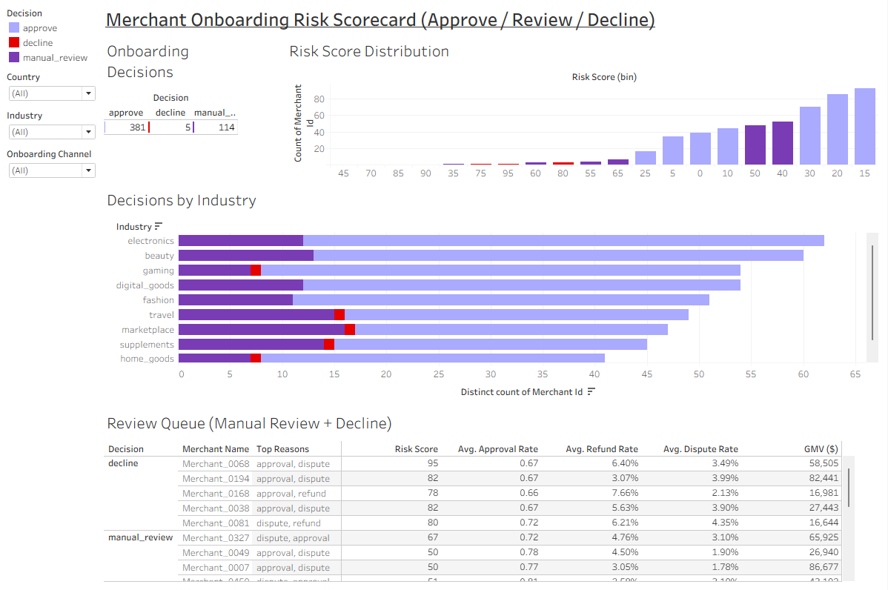
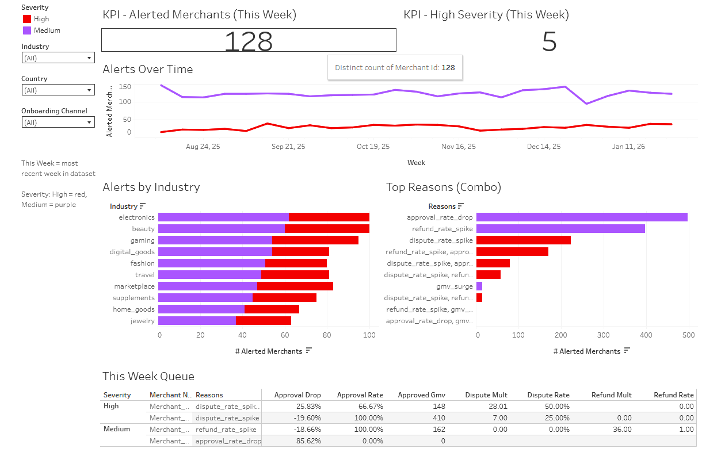

# Merchant Risk Analytics (Simulated BNPL)
**Tools:** SQL (SQLite), Python (Jupyter), Tableau Public  
**What this shows:** merchant onboarding risk decisions + weekly monitoring & alerts (Affirm-style)

## Tableau Public Dashboards
- **Onboarding Risk Scorecard (Approve / Review / Decline):** [Merchant Onboarding Dashboard](https://public.tableau.com/app/profile/kimberly.jarosch/viz/MerchantOnboardingRiskScorecardSimulatedData/MerchantOnboardingRiskScorecardApproveReviewDecline)
- **Monitoring & Alerts (Weekly):** [Merchant Monitoring Dashboard](https://public.tableau.com/app/profile/kimberly.jarosch/viz/merchant_monitoring_alerts_dashboard/MerchantMonitoringAlerts?publish=yes)

## Project Summary
This portfolio project simulates the merchant risk lifecycle:
1) **Onboarding Scorecard:** assigns merchants to approve / manual_review / decline using risk signals.
2) **Monitoring & Alerts:** flags weekly spikes/deterioration in key metrics (refunds, disputes, approval drop) and generates a triage queue with severity + reason codes.

## Key Features
- Rule-based alerting with baseline comparisons (weekly monitoring)
- Severity tiers (Medium / High)
- “Queue” view for operational triage
- Filters by country / industry / onboarding channel

## Repo Structure
- `notebooks/` → data simulation + feature engineering + alert logic
- `sql/` → SQLite queries for rollups/monitoring
- `tableau/` → Tableau workbooks (.twbx)
- `screenshots/` → dashboard screenshots

> Note: SQLite DB is not included in GitHub due to size. Data is simulated and reproducible from notebooks.

## Screenshots
### Onboarding Risk Scorecard

### Monitoring & Alerts

## How to Reproduce Locally
1. Run the notebooks in `notebooks/` to generate simulated CSV outputs  
2. (Optional) Load CSVs into SQLite (DB Browser for SQLite) using the queries in `sql/`  
3. Open Tableau workbooks in `tableau/` and connect to the CSV outputs

## What I’d Improve Next (Roadmap)
- Threshold tuning + alert suppression logic
- Basic model-based scoring for severity (logistic regression as a v2)
- Monitoring for drift / stability
